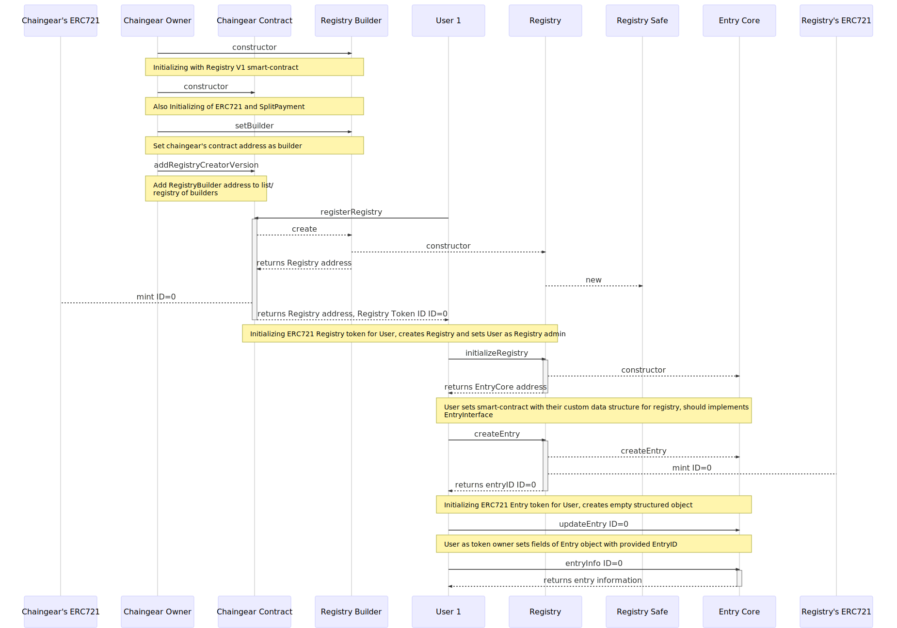

<h1 align="center">
  </a>
</h1>

<h3 align="center">The consensus computer driven database framework</h3>

  Current state: 0.1 Euler Chaingear's release for EVM with paper.

 

  
  

  
  
  

  Built by
  <a href="https://twitter.com/cyber_devs">cyber•Congress</a> and
  <a href="https://github.com/cybercongress/chaingear/graphs/contributors">
    contributors
  </a>

### Try EVM's Chaingear rigth now!
- [Mainnet](https://etherscan.io/address/0x02e0c94355562693B3608077732d7437bd7a78ca)
- [Kovan](https://kovan.etherscan.io/address/0x02e0c94355562693B3608077732d7437bd7a78ca)
- [Rinkeby](https://rinkeby.etherscan.io/address/0x02e0c94355562693B3608077732d7437bd7a78ca)

Chaingear Dapp (Mainnet, Kovan, Rinkeby) accessible **directly from IPFS**:
[QmQmQKkPFqLS4iNiicvAqx6aJtRpYookK8iEZjojcfEqib](https://cloudflare-ipfs.com/ipfs/QmQmQKkPFqLS4iNiicvAqx6aJtRpYookK8iEZjojcfEqib/#/)

Note: Best option to use **[CYB web3 browser](https://github.com/cybercongress/cyb/releases)** with **.chaingear** dapp, all contracts code **verified** with Etherscan.

### Whitepaper
[Chaingear - The consensus computer driven database framework](./whitepaper.md)

### Principles of Chaingear

Chaingear is a set of smart contracts which operating in consensus computer with following principles:

0. Databases creates by user createDatabase call for Chaingear witch mints database-linked NFT token for user and deploys database with support of CRUD+TF operations. Token controls adminship of database.
1. Admin initializes database with given table/tables data schema.
2. Database admin may set user permissions for entry creation and fee for adding.
3. Each entry in database linked to NFT token (primary key) which grants a set of rights for token-entry operation as UPDATE/DELETE and TRANSFER/FUND.
4. Chaingear for given platform acts as Consensus Computer Driven Database as a Service
5. Application specific business logic should be available to operate on top of database/databases.

### Chaingear on EVM, 0.1 Euler PoC

### Chaingear
- Chaingear is database of database which allow deploy new databases from there and creates an associated token for adminship.
- Chaingear allow deploys different types of databases with defined functionality with connects with databases builders.
- Database Builder is a fabric of databases of given type.
- Databases may have their unique code base as an extension to the basic database.
- Database-token may be transferred, sold/traded alongside with their right adminship.
- Chaingear have fees for database creation.
- Chaingear have benefitiaries which may claim collected fees proportional to their shares.

### Database
- A database is a smart contract which defines NFT tokens linked to entries. User creates database with given name and token symbol for entries.
- After deploy database admin initializes database with data schema table/tables and this allows them or/and other users to create a systematic collection of data, where rights to operations with entry defined by entry-token ownership.
- Entries data lives in Schema contract.
- Each entry may be publicly funded, an entry-token owner may claim collected funds.
- Database admin may set policy for entry creation: {OnlyAdmin, Whitelist, AllUsers} and fee for the entry-token creation and next claim fees.
- Also admin may set multiple database's beneficiaries which may claim collected fees proportional to their shares.

#### Chaingear UI (web3 DApp for EVM's Chaingear)

1. Web3/Metamask/Truffle/IPFS based
2. Full Chaingear control interface
3. Full custom Database control interface
4. Schema smart-contract code generation on client
5. Database ABI saves in IPFS

## [Contracts Overview](https://cybersearch.io/Chaingear/contracts/)

## [Configuring and deploying](https://cybersearch.io/Chaingear/development/)

## General Chaingear/Database pipeline

### web3 Application
#### General
| | |
|-|-|
|||

#### Database
| | |
|-|-|
|||

#### Database Deploy and Schema designer
| | |
|-|-|
|||

## Join Us On Telegram

If you're interested in using or developing Chaingear, come [join us on Telegram](https://t.me/fuckgoogle)

## Gitcoin Tasks

## Built With

* [OpenZeppelin](https://zeppelin-solidity)
* [Truffle](https://truffleframework.com)
* [Web3.js](https://github.com/ethereum/web3.js/)
* [IPFS]()

## Prerequisites:

- [Node.js](https://nodejs.org/en/download/)
- [Truffle](http://truffleframework.com/)
- [Parity](https://www.parity.io/)

## Authors

Originally created by [cyber•Congress](https://twitter.com/cyber_devs)

## License

[Cyber License](./LICENCE)
