<h1 align="center">
  </a>
</h1>

# Chaingear

## The Ethereum framework for tokenized registries
##### litvintech and xhipster, Developer's Board Members, cyber•Congress

### Position
With the rising of decentralized computing and web3 becoming, we need fundamental peace of web3 infrastructure as decentralized registries and databases. But as web3(link to paper) different to web2 there are new approaches and challenges for their development and operating. 
In this paper, we are describing Chaingear and their PoC - novel Ethereum's open-source framework for developing tokenized registries based on smart-contracts with custom data schema and CRUD operations for interacting with. Plus meta-registry as one point of access for all.

### Short
0. Registry initializes with user-defined schema and provides CRUD operations for entries. 
1. Each entry linked with NFT token (primary key) which grants a set of rights for token-entry operation as Update/Delete, Transfer/Claim/Sell/Trade. 
2. Registry admin may set user permissions for entry creation and also fee for creation, claim fees.
3. Chaingear is a meta-registry of registries where each registry linked with NFT token and allows adminship of the registry. A token-registry may be transferred or sold alongside as admin rights. 
4. Registries create and deploy from Chaingear.

##### Note: NFT --> ERC 721, Sell/Trade with 0x relayer's.

### Registry
#### Basic
0. A registry is a smart contract which defines NFT tokens linked to entries. 
1. A user creates a registry with given name and token symbol.
2. Registry creator initializes registry with data schema and this allows them or/and other users to create a systematic collection of data, where rights to operations with entry defined by entry-token ownership. 
3. Each entry may be publicly funded, an entry-token owner may claim collected funds.
4. Registry admin may set policy for entry creation: {OnlyAdmin, Whitelist, AllUsers}.
5. Registry admin may set a fee for the entry-token creation and claim fees.
6. Registry admin may set description and tags (up to 16) for a registry. 

#### Tokenization
0. Token **Create** operation initialize empty entry.
0. Each entry-token have tokenized operations as **Update**/**Delete**, Transfer/Claim/Sell/Trade.
1. Each entry-token may be transferred alongside their right to tokenized operations.
2. Each entry-token may be sold or traded with 0'x relayer.
3. Token also a link to entry lives in Registry contract.

#### CRUD++: 
0. Create mints token and initialize empty entry.
1. Read are publicly available.
1. Update allows set value of entry fields.
2. Delete burns token and deletes an entry.

#### Schema
0. With Schema creator defines the schema of a registry as fields of a table.
1. Creator initializes Registry with Schema.
3. Entries data lives in Schema contract.
2. Registry acts as an owner to a schema, triggers empty entries creation (C) and deletion of entry (D).
4. Update for entry may be specified as one operation for updating all fields, one by one, both of this.
5. Uniqueness check by field value may be added.

### Chaingear
0. Chaingear is a metaregistry of registries.
1. Chaingear creates an associated token to a registry.
2. Chaingear's admins' register Registry Builders which acts as fabrics of different types of a registry.
3. Registries may have their unique code base as an extension to the basic registry.
4. Registry-token may be transferred, sold/traded alongside with their right adminship.
5. Chaingear have fees for registry creation.

### Registry Builder
0. Registry Builder is a smart contract which acts as fabrics and deploys registries.
1. Registry Builder should be registered in Chaingear.
2. Registry Builder on Registry deploys transfer ownership to Chaingear.
3. Chaingear sets registry creator as admin of registry, mints token for a creator.

### Safe
0. Chaingear's registries and Registry's entries may collect funds.
1. Funds stored in Safe
2. Chaingear and all Registries have their Safes.
3. Information about funds allocation stored as meta information of registries/entries.
4. Registry or Entry owner may collect funds, and there will be transferred from a given Safe contract.

### Workflows
#### Chaingear setup and Registry creation/schema initialization pipeline


#### Registry CRUD/Entry-token pipeline


#### Chaingear's Registry-token pipeline


### Inheritance
#### Chaingear inheritance 


#### Registry inheritance


### web3 Application
#### General
| | |
|-|-|
|||

#### Registry
| | | |
|-|-|-|
||||

#### Schema designer


#### Persistent sources
0. For interaction with registries, we need ABI for contracts.
1. ABIs may be saved on some nodes and accessed with IPFS, but this is not guaranteed, for sure.
2. The Ethereum itself is persistent storage, and it's a point to save ABIs and source code in Ethereum which guarantees registries operation, we choose this point.
3. The total size of user's schema + ABI usually less than 10kb
4. Estimation of cost -> 10kb == 10,240 bytes -> word is 32 bytes -> words 10,240/32 = 320 -> write single word 20k gas -> gas cost is 320 * 20000 gas = 6.4M gas ~ 14$ with 10 Gwei

### Gas
#### Chaingear
| Operation          | Gas | Cost (10gwei) |
|--------------------|-----|---------------|
| registerRegistry   |     |               |
| transferFrom       |     |               |
| fundRegistry       |     |               |
| claimRegistryFunds |     |               |
| unregisterRegistry |     |               |

#### Registry
| Operation          | Gas | Cost (10gwei) |
|--------------------|-----|---------------|
| initializeRegistry |     |               |
| createEntry (C)    |     |               |
| deleteEntry (D)    |     |               |
| fundEntry          |     |               |
| claimEntryFunds    |     |               |
| unregisterRegistry |     |               |

#### Schema
| Operation          | Gas | Cost (10gwei) |
|--------------------|-----|---------------|
| readEntry (R)      |     |               |
| updateEntry (U)    |     |               |

##### Note: 1 ETH ~ 220$, gas estimation for basic schema

### Proof of Concept
#### Notes on release 0.2.5
0. Chaingear smart-contract
1. Basic Registry smart-contract
2. Registry Builder smart-contract
3. Safe smart-contract
4. Schema examples smart-contracts
5. web3 application 
6. General and developers documentation
7. Basic tests (?% coverage)
8. CYB web3 browser integration

#### Usage Examples
0. Application Store of CYB's web browser
1. Root Registry
2. Cybernodes registry of web3 nodes-providers
3. cyber•Search team's members
4. Robots registry
5. Features registry of your project 
...

#### Limitations
0. Up to 6 fields in schema (?)

### Call to community
0. Standardization and EIP proposal
1. Special purpose registries
2. Security
3. Community ideas

### Future work and releases
0. Design and architecture
1. Security
2. Optimization of data writes and reads
3. Indexes and operations.

### Development
Maintainers: @litvintech, @xhipster, @pechalka

### Code
Example Schema:
```
pragma solidity 0.4.25;

import "../common/IEntry.sol";
import "openzeppelin-solidity/contracts/math/SafeMath.sol";
import "openzeppelin-solidity/contracts/ownership/Ownable.sol";
import "openzeppelin-solidity/contracts/introspection/SupportsInterfaceWithLookup.sol";

interface IRegistrySchema {
    function getIndexByID(uint256) external view returns (uint256);
    function getEntriesIDs() external view returns (uint256[]);
    function updateEntryTimestamp(uint256) external;
    function checkEntryOwnership(uint256, address) external;
}

contract NodesSchema is IEntry, Ownable, SupportsInterfaceWithLookup {
    
    using SafeMath for uint256;
    
    bytes4 internal constant InterfaceId_EntryCore = 0xd4b1117d;

    struct Entry {
        string  name;
        string  addressNode;
        string  services;
        string  description;
        string  operating;
    }
    
    mapping(string => bool) internal nameUniqIndex;
    
    Entry[] public entries;
    
    constructor()
        public
    {
        _registerInterface(InterfaceId_EntryCore);
    }
    
    function() external {} 
    
    function createEntry(uint256 _entryID)
        external
        onlyOwner
    {
        Entry memory m = (Entry(
        {
            name:           "",
            addressNode:    "",
            services:       "",
            description:    "",
            operating:      ""
    
        }));

        entries.push(m);
    }
    
    function readEntry(uint256 _entryID)
        external
        view
        returns (
            string,
            string,
            string,
            string,
            string
        )
    {
        uint256 entryIndex = IRegistrySchema(owner).getIndexByID(_entryID);
        return (
            entries[entryIndex].name,
            entries[entryIndex].addressNode,
            entries[entryIndex].services,
            entries[entryIndex].description,
            entries[entryIndex].operating
        );
    }

    function updateEntry(
        uint256 _entryID,
        string  _name,
        string _addressNode,
        string _services,
        string _description,
        string _operating
    )
        external
    {
        IRegistrySchema(owner).checkEntryOwnership(_entryID, msg.sender);
        
        require(nameUniqIndex[_name] == false);
        nameUniqIndex[_name] = true;
        
        uint256 entryIndex = IRegistrySchema(owner).getIndexByID(_entryID);
        
        string storage lastName = entries[entryIndex].name;
        nameUniqIndex[lastName] = false;
            
        Entry memory m = (Entry(
        {
            name:           _name,
            addressNode:    _addressNode,
            services:       _services,
            description:    _description,
            operating:      _operating
        }));
        entries[entryIndex] = m;
        
        IRegistrySchema(owner).updateEntryTimestamp(_entryID);
    }

    function deleteEntry(uint256 _entryID)
        external
        onlyOwner
    {
        require(entries.length > uint256(0));
        uint256 entryIndex = IRegistrySchema(owner).getIndexByID(_entryID);
        
        string storage nameToClear = entries[entryIndex].name;
        nameUniqIndex[nameToClear] = false;
        
        uint256 lastEntryIndex = entries.length.sub(1);
        Entry memory lastEntry = entries[lastEntryIndex];
        
        entries[entryIndex] = lastEntry;
        delete entries[lastEntryIndex];
        entries.length--;
    }

    function getEntriesAmount()
        external
        view
        returns (uint256)
    {
        return entries.length;
    }
    
    function getEntriesIDs()
        external
        view
        returns (uint256[])
    {
        return IRegistrySchema(owner).getEntriesIDs();
    }
    
}

```
