# Contracts Overview

## Design rationale

Main design principle goes from ERC721 NFT tokenization of Registries (in Chaingear/Metaregistry) and Entries (in custom Registry). 

In reason of Registries tokenization in Chaingear which allows token holder acts as administrator of their Registry, Chaingear acts to Registry as owner, which sets token holder as administrator on creation phase, changes administrator when holder transfers token to another user, and transfers ownership when user unregister Registry in Chaingear, giving them full control to contract. Registry deep-linked to Chaingear registry token. In other words, token ownership means control of Registry. Also, Chaingear supports multiple Registry Builders (fabrics of registries of given type), and allows Chaingear owners provide different kind and versioning of Registries.

In reason of providing user functionality to describe their custom registry data structures and CRUD operations, the user creates their custom smart-contract, which implements the EntryInterface interface. This contract acts as inner storage, defines schema, and Registry acts them on token operations (creating and deleting). A user may deploy erroneous or vulnerable EntryCore contract, but this should not crash Chaingear-Registry NFT-token logic and Registry inner entry NFT-logic too. Even if this happens Registry crashing should not affect Chaingear/metaregistry contract. We proceed from the premise that the creator of the registry (administrator) is positive and it does not make sense for them to break his registry by initializing it with an incorrect contract.

This brings us to tokenized (**C** _RU_ **D**) operations (and inner in EntryCore) in Registry-EntryCore and public (_C_ **R** _UD_) actions/direct EntroCore tokenized (_CR_ **U** _D_) operations.

## Chaingear inheritance 


## Registry inheritance


##### PS: OZ stands to Open Zeppelin contracts

### /chaingear
- **_Chaingear_** allows any user to create his own registry. 
1. Building fee is collecting by new registry creation. 
2. All builded registries are tokenized with ERC721 NFT token standard and saved in Chaingear metaregistry with registry metainformation. 
3. Creator of registry may transfer tokenized ownership of registry and destroy registry with token burning. 
4. Tokenized registries Entries may collect funds by users and Registries owner may claim them. 
5. Chaingear supports multiple benefitiaries witch have access to collected fees from registries creation. 
6. Also allows for owner add multiple registry builders contracts based registries on versioning or/and functionality.

### /builder
- **_RegistryBuilder_** contains the code of specified version of Registry. This code used by Chaingear for Registry creation and deploy process. Registry Builder should be added with specified version and description to Chaingear registry builders inner registry. Chaingear contract should be added as builder to Registry Builder with reason to allow creation calls only by Chaingear contact.

### /common
- **_RegistySafe_** allows creator contract transfer ETHs to them and claim from, accounting logic holded by owner contract.

- **_IEntry_**
 
- **_IRegistry_** 

### /registry
- **_Registry_** contract witch tokenize entries as NFT tokens via ERC721 standard. Users can create tokenized empty entries according to entry access policy setted in Registry. Registry provides tokenized (**C** _RU_ **D**) actions, after creation of token and empty registry object, user should initialize them (_CR_ **U** _D_) in EntryCore. Also users can fund entries with ETHs which send to _RegistrySafe_ with which owner of entry token can claim funds.

- **_RegistryAccessControl_** holds logic of controlling registry and accessing to entries creation. Policy options to entries creation are OnlyAdministrator, Whitelist, AllUsers. Chaingear acts as owner of Registry and creator of registry acts of administrator with separated policies to Registry functions.

### /schemas
- **_EntryCore_** partially code-generated contract where registry creator setup their custom entry structure and setters/getters. _EntryCore_ then initializes in Registry by their creator (as admin) and completes Registry setup process. Provides public (_C_ **RU** _D_) actions for users and inner (**C** _RU_ **D**) tokenized actions for Registry.  Registry goes as owner of contract (and acts as proxy) with entries creating, token-based transferring and deleting.

#### EntryInterface interface (should be implemented in user EntryCore contract)
```js
contract EntryInterface {

    function entriesAmount() external view returns (uint256);
    function createEntry() external returns (uint256);
    function deleteEntry(uint256) external;
}
```

#### Example EntryCore (with example custom structure and required functions)
```js
pragma solidity 0.4.25;

import "../common/EntryInterface.sol";
import "openzeppelin-solidity/contracts/ownership/Ownable.sol";


//This is Example of EntryCore
contract EntryCore is EntryInterface, Ownable {

    struct Entry {
        address expensiveAddress;
        uint256 expensiveUint;
        int128 expensiveInt;
        string expensiveString;
    }
    
    mapping(string => bool) internal entryExpensiveStringIndex;
    
    Entry[] internal entries;
    
    function() external {}
    
    function createEntry()
        external
        onlyOwner
        returns (uint256)
    {
        Entry memory m = (Entry(
        {
            expensiveAddress: address(0),
            expensiveUint: uint256(0),
            expensiveInt: int128(0),
            expensiveString: ""
        }));

        uint256 newEntryID = entries.push(m) - 1;

        return newEntryID;
    }

    function updateEntry(
        uint256 _entryID, 
        address _newAddress, 
        uint256 _newUint, 
        int128 _newInt, 
        string _newString
    )
        external
    {
        require(owner.call(bytes4(keccak256("checkAuth(uint256, address)")), _entryID, msg.sender));
        
        // for uniq check example
        require(entryExpensiveStringIndex[_newString] == false);
            
        Entry memory m = (Entry({
            expensiveAddress: _newAddress,
            expensiveUint: _newUint,
            expensiveInt: _newInt,
            expensiveString: _newString
        }));
        entries[_entryID] = m;
        
        // for uniq check example
        entryExpensiveStringIndex[_newString] = true;
        
        require(owner.call(bytes4(keccak256("updateEntryTimestamp(uint256)")), _entryID));
    }

    function deleteEntry(
        uint256 _entryIndex
    )
        external
        onlyOwner
    {
        uint256 lastEntryIndex = entries.length - 1;
        Entry storage lastEntry = entries[lastEntryIndex];

        entries[_entryIndex] = lastEntry;
        delete entries[lastEntryIndex];
        entries.length--;
    }

    function entriesAmount()
        external
        view
        returns (uint256 entryID)
    {
        return entries.length;
    }

    function entryInfo(
        uint256 _entryID
    )
        external
        view
        returns (
            address, 
            uint256, 
            int128, 
            string
        )
    {
        return (
            entries[_entryID].expensiveAddress,
            entries[_entryID].expensiveUint,
            entries[_entryID].expensiveInt,
            entries[_entryID].expensiveString
        );
    }

}
```
    