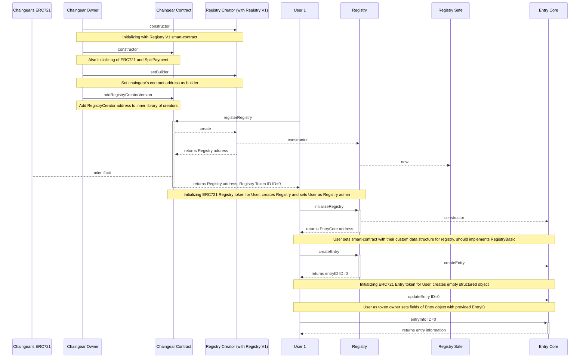
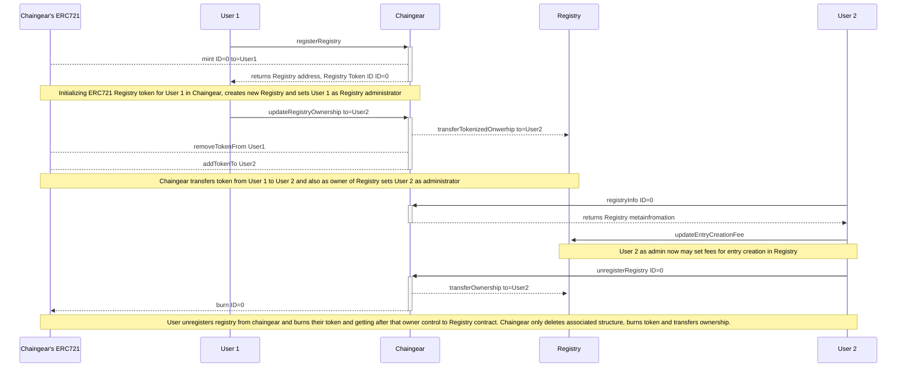

## General Chaingear/Registry pipeline



## Registry CRUD/tokenized Entry/Funds pipeline

```mermaid
sequenceDiagram
    participant A as Admin
    participant S as Registry Safe
    participant R as Registry
    participant EC as Entry Core
    participant U1 as User 1
    participant 721 as Registry's ERC721
    participant U2 as User 2
    participant U3 as User 3/Funder
    
    A->>+R: initializeRegistry
    R-->>EC: constructor
    R-->>-A: returns EntryCore address
    Note over A, EC: User sets smart-contract with their custom data structure for registry, should implements RegistryBasic
    
    A->>R: updateCreateEntryPermissionGroup
    Note over A, R: Available OnlyAdmin, Whitelist*, AllUsers groups
    
    U1->>+R: createEntry
    R-->>EC: createEntry
    R-->721: mint ID=0
    R-->>-U1: returns entryID ID=0
    Note over U1, R: df
    
    U1->>EC: updateEntry ID=0
    Note over U1, EC: User 1 as token owner sets fields of Entry object with provided EntryID
    
    U1->>+EC: entryInfo ID=0
    EC-->>-U1: returns entry information
    
    U1->>+R: transferEntryOwnership ID=0
    R-->721: removeTokenFrom ID=0
    R-->721: addTokenTo ID=0
    R-->>-EC: updateEntryOwnership
    Note over U1, R: df
    
    U2->>EC: updateEntry ID=0
    Note over U1, EC: User 1 as token owner sets fields of Entry object with provided EntryID
    
    U3->>+EC: entryInfo ID=0
    EC-->>-U3: returns entry information
    
    U3->>+R: fundEntry ID=0 funds=1ETH
    R-->>EC: updateEntryFund +1ETH
    R-->>-S: transfer =1ETH
    Note over S, EC: Funded ETHs goes to Registry Safe contract, ETHs adds to balance and amount for accounting stores in Registry.
    
    U2->>+R: claimEntryFund claim=1ETH
    R-->>EC: claimEntryFund -1ETH
    R-->>S: claim =1ETH
    S-->>-U2: transfer =1ETH
    Note over S, EC: Owner of Entry claim funds and registry checks balance for existing claim amount, subtract them, calls Registry Safe to send funds to User.
    
    U2->>+R: deleteEntry
    R-->721: burn ID=0
    R-->>-EC: deleteEntry
    Note over R, EC: Registry burns associated to Entry NFT token and deletes entry object in EntryCore.
```

## Chaingear tokenized Registries pipeline

