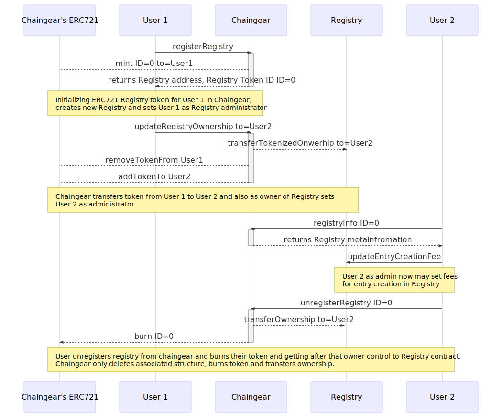

# Chaingear

## The Ethereum framework for tokenized databases
##### litvintech and xhipster, Developer's Board Members, cyber•Congress

### Position
With the rising of decentralized computing and web3 becoming, we need fundamental peace of web3 infrastructure as decentralized databases and databases. But as web3(link to paper) different to web2 there are new approaches and challenges for their development and operating. 
In this paper, we are describing Chaingear and their PoC - novel Ethereum's open-source framework for developing tokenized databases based on smart-contracts with custom data schema and CRUD operations for interacting with. Plus meta-database as one point of access for all.

### Short
0. Database initializes with user-defined schema and provides CRUD operations for entries. 
1. Each entry linked with NFT token (primary key) which grants a set of rights for token-entry operation as Update/Delete, Transfer/Claim/Sell/Trade. 
2. Database admin may set user permissions for entry creation and also fee for creation, claim fees.
3. Chaingear is a meta-database of databases where each database linked with NFT token and allows adminship of the database. A token-database may be transferred or sold alongside as admin rights. 
4. Databases create and deploy from Chaingear.

##### Note: NFT --> ERC 721, Sell/Trade with 0x relayer's.

### Database
#### Basic
0. A database is a smart contract which defines NFT tokens linked to entries. 
1. A user creates a database with given name and token symbol.
2. Database creator initializes database with data schema and this allows them or/and other users to create a systematic collection of data, where rights to operations with entry defined by entry-token ownership. 
3. Each entry may be publicly funded, an entry-token owner may claim collected funds.
4. Database admin may set policy for entry creation: {OnlyAdmin, Whitelist, AllUsers}.
5. Database admin may set a fee for the entry-token creation and claim fees.
6. Database admin may set description and tags (up to 16) for a database. 
7. Database supports multiple beneficiaries which may claim collected fees proportional to their shares.

#### Tokenization
0. Token **Create** operation initialize empty entry.
0. Each entry-token have tokenized operations as **Update**/**Delete**, Transfer/Claim/Sell/Trade.
1. Each entry-token may be transferred alongside their right to tokenized operations.
2. Each entry-token may be sold or traded with 0'x relayer.
3. Token also a link to entry lives in Database contract.

#### CRUD++: 
0. Create mints token and initialize empty entry.
1. Read are publicly available.
1. Update allows set value of entry fields.
2. Delete burns token and deletes an entry.

#### Schema
0. With Schema creator defines the schema of a database as fields of a table.
1. Creator initializes Database with Schema.
3. Entries data lives in Schema contract.
2. Database acts as an owner to a schema, triggers empty entries creation (C) and deletion of entry (D).
4. Update for entry may be specified as one operation for updating all fields, one by one, both of this.
5. Uniqueness check by field value may be added.

### Chaingear
0. Chaingear is a metadatabase of databases.
1. Chaingear creates an associated token to a database.
2. Chaingear's admins' register Database Builders which acts as fabrics of different types of a database.
3. Databases may have their unique code base as an extension to the basic database.
4. Database-token may be transferred, sold/traded alongside with their right adminship.
5. Chaingear have fees for database creation.
6. Chaingear have benefitiaries which may claim collected fees proportional to their shares.

### Database Builder
0. Database Builder is a smart contract which acts as fabrics and deploys databases.
1. Database Builder should be registered in Chaingear.
2. Database Builder on Database deploys transfer ownership to Chaingear.
3. Chaingear sets database creator as admin of database, mints token for a creator.

### Safe
0. Chaingear's databases and Database's entries may collect funds.
1. Funds stored in Safe
2. Chaingear and all Databases have their Safes.
3. Information about funds allocation stored as meta information of databases/entries.
4. Database or Entry owner may collect funds, and there will be transferred from a given Safe contract.

### Workflows
#### Chaingear setup and Database creation/schema initialization pipeline


#### Database CRUD/Entry-token pipeline


#### Chaingear's Database-token pipeline


### Inheritance
#### Chaingear inheritance 


#### Database inheritance


### web3 Application
#### General
| | |
|-|-|
|||

#### Database
| | | |
|-|-|-|
||||

#### Schema designer


#### Persistent sources
0. For interaction with databases, we need ABI for contracts.
1. ABIs may be saved on some nodes and accessed with IPFS, but this is not guaranteed, for sure.
2. The Ethereum itself is persistent storage, and it's a point to save ABIs and source code in Ethereum which guarantees databases operation, we choose this point.
3. The total size of user's schema + ABI usually less than 10kb
4. Estimation of cost -> 10kb == 10,240 bytes -> word is 32 bytes -> words 10,240/32 = 320 -> write single word 20k gas -> gas cost is 320 * 20000 gas = 6.4M gas ~ 14$ with 10 Gwei

### Gas
#### Chaingear
| Operation          | Gas | ~Cost, $ |
|--------------------|-----|---------------|
| createDatabase   |3.3kk|7              |
| transferFrom       |105k |0.2            |
| fundDatabase       |75k  |0.15           |
| claimDatabaseFunds |27k  |0.05           |
| deleteDatabase |     |               |

#### Database
| Operation          | Gas | ~Cost, $ |
|--------------------|-----|---------------|
| initializeDatabase |     |               |
| createEntry (C)    |     |               |
| deleteEntry (D)    |     |               |
| fundEntry          |     |               |
| claimEntryFunds    |     |               |

#### Schema
| Operation          | Gas | ~Cost, $ |
|--------------------|-----|---------------|
| readEntry (R)      |     |               |
| updateEntry (U)    |     |               |

##### Note: 1 ETH ~ 220$, Gas Cost = 10 Gwei, gas estimation for basic schema

### Proof of Concept
#### Notes on release 0.2.5
0. Chaingear smart-contract
1. Basic Database smart-contract
2. Database Builder smart-contract
3. Safe smart-contract
4. Schema examples smart-contracts
5. web3 application 
6. General and developers documentation
7. Basic tests (?% coverage)
8. CYB web3 browser integration

#### Usage Examples
0. Application Store of CYB's web browser
1. Root Database
2. Cybernodes database of web3 nodes-providers
3. cyber•Search team's members
4. Robots database
5. Features database of your project 
6. Exchange Traded Funds..
...

#### Limitations
0. Up to 6 fields in schema (?)

### Call to community
0. Standardization and EIP proposal
1. Special purpose databases
2. Security
3. Community ideas

### Future work and releases
0. Design and architecture
1. Security
2. Optimization of data writes and reads
3. Indexes and operations.

### Development
Maintainers: @litvintech, @xhipster, @pechalka

### Code
Example Schema:
```
pragma solidity 0.4.25;

import "../common/ISchema.sol";
import "../common/IDatabase.sol";
import "openzeppelin-solidity/contracts/ownership/Ownable.sol";
import "openzeppelin-solidity/contracts/introspection/SupportsInterfaceWithLookup.sol";


contract AppsSchema is ISchema, Ownable, SupportsInterfaceWithLookup {
    
    bytes4 constant internal INTERFACE_SCHEMA_ID = 0x153366ed;

    struct Entry {
        string name;
        string manifest;
        string extension;
        string content;
        string logo;
    }
    
    Entry[] public entries;
    
    IDatabase internal database;
    
    constructor()
        public
    {
        _registerInterface(INTERFACE_SCHEMA_ID);
        database = IDatabase(owner);
    }
    
    function() external {} 
    
    function createEntry()
        external
        onlyOwner
    {
        Entry memory m = (Entry(
        {
            name:       "",
            manifest:   "",
            extension:  "",
            content:    "",
            logo:       ""
        }));

        entries.push(m);
    }
    
    function readEntry(uint256 _entryID)
        external
        view
        returns (
            string,
            string,
            string,
            string,
            string
        )
    {
        uint256 entryIndex = database.getIndexByID(_entryID);
        return (
            entries[entryIndex].name,
            entries[entryIndex].manifest,
            entries[entryIndex].extension,
            entries[entryIndex].content,
            entries[entryIndex].logo
        );
    }

    function updateEntry(
        uint256 _entryID,
        string  _name,
        string  _manifest,
        string  _extension,
        string  _content,
        string  _logo
    )
        external
    {
        database.auth(_entryID, msg.sender);
        
        uint256 entryIndex = database.getIndexByID(_entryID);
            
        Entry memory m = (Entry(
        {
            name:       _name,
            manifest:   _manifest,
            extension:  _extension,
            content:    _content,
            logo:       _logo
        }));
        entries[entryIndex] = m;
    }

    function deleteEntry(uint256 _entryIndex)
        external
        onlyOwner
    {        
        uint256 lastEntryIndex = entries.length - 1;
        Entry memory lastEntry = entries[lastEntryIndex];
        
        entries[_entryIndex] = lastEntry;
        delete entries[lastEntryIndex];
        entries.length--;
    }
    
}
```
